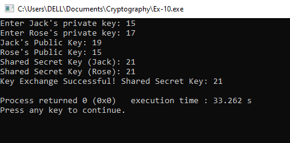

# EX-NO-10-Diffie-Hellman-Key-Exchange-Algorithm

## AIM:
To Implement Diffie Hellman Key Exchange Algorithm 

## Algorithm:

1. Diffie-Hellman Key Exchange is used for securely sharing a secret key between two parties over an insecure channel.

2. Initialization: Agree on a large prime number \( p \) and a primitive root \( g \) modulo \( p \) (both are public values).

3. Key Exchange Process: 
   - Each party selects a private key and calculates their public key using the formula \( g^{\text{private key}} \mod p \).
   - Each party then shares their public key with the other.

4. Secret Key Computation: 
   - Each party computes the shared secret key using the received public key and their own private key.

5. Security: The difficulty of computing discrete logarithms ensures that the shared key remains secure even if public values are intercepted.

## Program:
```
#include <stdio.h>
#include <math.h>

// Function to calculate (base^exp) % mod using modular exponentiation
int modExp(int base, int exp, int mod) {
    int result = 1;
    base = base % mod;
    while (exp > 0) {
        if (exp % 2 == 1) {
            result = (result * base) % mod;
        }
        exp = exp >> 1;
        base = (base * base) % mod;
    }
    return result;
}

int main() {
    // Publicly known values
    int p = 23;  // A large prime number
    int g = 5;   // A primitive root modulo p

    // Private keys (chosen secretly by Jack and Rose)
    int jackPrivateKey, rosePrivateKey;
    printf("Enter Jack's private key: ");
    scanf("%d", &jackPrivateKey);
    printf("Enter Rose's private key: ");
    scanf("%d", &rosePrivateKey);

    // Public keys (computed from private keys)
    int jackPublicKey = modExp(g, jackPrivateKey, p);  // Jack's public key
    int rosePublicKey = modExp(g, rosePrivateKey, p);  // Rose's public key

    printf("Jack's Public Key: %d\n", jackPublicKey);
    printf("Rose's Public Key: %d\n", rosePublicKey);

    // Shared secret keys (computed from the other's public key and own private key)
    int sharedKeyJack = modExp(rosePublicKey, jackPrivateKey, p);  // Jack computes the shared secret key
    int sharedKeyRose = modExp(jackPublicKey, rosePrivateKey, p);  // Rose computes the shared secret key

    printf("Shared Secret Key (Jack): %d\n", sharedKeyJack);
    printf("Shared Secret Key (Rose): %d\n", sharedKeyRose);

    // The shared keys should be the same
    if (sharedKeyJack == sharedKeyRose) {
        printf("Key Exchange Successful! Shared Secret Key: %d\n", sharedKeyJack);
    } else {
        printf("Key Exchange Failed!\n");
    }

    return 0;
}

```

## Output:



## Result:
  The program is executed successfully

